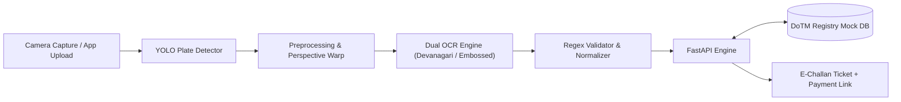

# 🇳🇵 Nepal Traffic ANPR & E-Challan Ticketing Engine

[](https://www.python.org/downloads/)
[](https://fastapi.tiangolo.com)
[](https://github.com/ultralytics/ultralytics)
[](https://opensource.org/licenses/MIT)
[](https://fedoraproject.org)

An intelligent Computer Vision and REST API engine designed for **Nepali Automatic Number Plate Recognition (ANPR)** and automated **traffic violation reporting (E-Challan)**. 

Engineered to resolve real-world challenges in Nepal: dual-script license plates (Devanagari script + English embossed), multi-line layouts, and seamless integration with Department of Transport Management (DoTM / यातायात व्यवस्था विभाग) registry standards.

---

## 📌 Key Capabilities

- **Dual-Script Recognition:** Handles traditional Devanagari plates (`बा २ ख १२३४`, `बागमती ०१-०२५ च ५६७८`) and modern Embossed English plates (`BAGMATI 01-028 CA 1234`).
- **Nepali Vehicle Syntax Parsing:** Automatic identification of vehicle category (`प` for 2-wheelers, `ख` for public buses, `च` for private cars, etc.) and provincial zone.
- **E-Challan Ticketing Engine:** Issues digital violation tickets with geo-location, timestamp, fine calculation, and payment link generation.
- **DoTM Integration Layer:** Schema-ready mock database for vehicle owner registry lookups.
- **Synthetic Plate Generator:** Built-in module to generate thousands of labeled Devanagari plates for deep learning training before real-world dataset collection.

---

## 🏗️ System Architecture



---

## 📂 Repository Structure

```
nepal-traffic-anpr/
├── data/                  # Datasets (raw, processed, synthetic)
├── models/                # YOLO & OCR model weights (.pt, .onnx)
├── notebooks/             # Exploratory notebooks & data analysis
├── src/
│   ├── api/               # FastAPI backend & E-Challan ticketing
│   ├── config.py          # Centralized configuration & settings
│   ├── detection/         # YOLO vehicle & plate detection pipeline
│   ├── ocr/               # Character recognition for Nepali fonts
│   ├── preprocessing/     # Deskew, contrast enhancement & rectification
│   ├── rules/             # Devanagari syntax parsing & DoTM vehicle rules
│   └── synthetic/         # Synthetic plate generation script
├── tests/                 # Unit test suite (pytest / unittest)
├── docker/                # Production containerization
├── docker-compose.yml
├── pyproject.toml         # Modern uv/pip packaging
└── README.md
```

---

## 🚀 Quickstart Guide (Fedora / Linux)

### 1. Prerequisites
Ensure you have `git` and Python installed:
```bash
sudo dnf install git curl ffmpeg
```

### 2. Clone the Repository
```bash
git clone https://github.com/<your-username>/nepal-traffic-anpr.git
cd nepal-traffic-anpr
```

### 3. Setup Virtual Environment (Recommended with `uv`)
```bash
# Install uv if you don't have it
curl -LsSf https://astral.sh/uv/install.sh | sh

# Create virtual environment with Python 3.11
uv venv --python 3.11
source .venv/bin/activate

# Install dependencies
uv pip install -r requirements.txt
```

*(Alternatively, with standard Python:)*
```bash
python3 -m venv .venv
source .venv/bin/activate
pip install -r requirements.txt
```

### 4. Run the Unit Tests
Verify the Nepali plate parser and conversion logic:
```bash
python3 -m unittest discover tests
```

### 5. Generate Synthetic Training Data
Generate synthetic Nepali plates for model training:
```bash
python3 -m src.synthetic.generator
```

### 6. Start the API Server
Launch the FastAPI development server:
```bash
uvicorn src.api.main:app --reload --port 8000
```
Visit **http://localhost:8000/docs** to interact with the Swagger API UI.

---

## 🚦 API Endpoints Overview

| Method | Endpoint | Description |
|---|---|---|
| `GET` | `/health` | Service health status check |
| `POST` | `/api/v1/analyze-plate` | Upload image -> Detect plate + OCR + Parse syntax |
| `GET` | `/api/v1/vehicles/{plate_number}` | Query DoTM vehicle registration records |
| `POST` | `/api/v1/violations/issue` | Issue a digital E-Challan violation ticket |

---

## 🗺️ Project Roadmap

- [x] **Milestone 1:** Repository architecture, Nepali plate regex validator, mock DoTM registry API.
- [x] **Milestone 2:** Synthetic Devanagari plate dataset generator.
- [ ] **Milestone 3:** Collect & annotate 500+ real-world Nepali vehicle plates on Roboflow.
- [ ] **Milestone 4:** Fine-tune YOLOv8-nano on Nepali license plates.
- [ ] **Milestone 5:** Train CRNN / fine-tune PaddleOCR on Nepali characters.
- [ ] **Milestone 6:** Flutter mobile client for Traffic Police officers.

---

## 👨‍💻 Author

**Sushant Singh Thapa**  
*Data Science Undergraduate*  
GitHub: [@sushantt-ds](https://github.com/sushantt-ds) • Email: sushantt.ds@gmail.com
